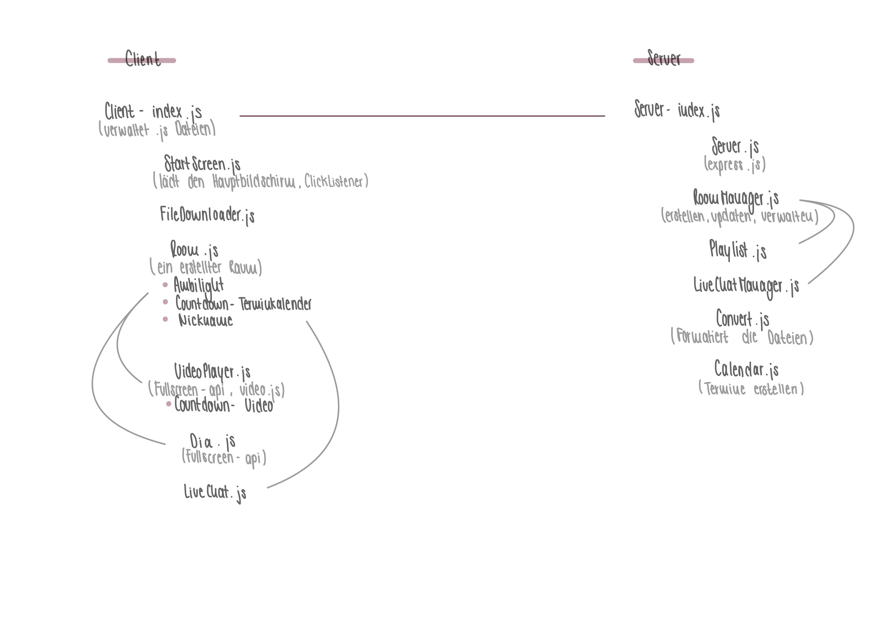

# Software Desing für WatchMates

## Client
**index.js:**

Zentrale Kommunikationsschnittstelle mit dem Server. Verwaltet alle anderen Client Module.

**StartScreen.js**

User-Interface für Startscreen,
StartScreen.js gibt User die Möglichkeit über einen Button eine Anfrage an den Server zu senden, um eine Unterseite zu erstellen und leitet ihn auf diese weiter.
Der User kann auch einem existierenden Raum beitreten, über einen vorgefertigten Button + Input Feld (für Link). Gibt der Server das "OK" leitet er ihn auf die Unterseite weiter. Über einen weiteren Button "Raum reservieren" kann der User ein Datum festlegen, einen Raum erstellen und sich den Termin als ICS herunterladen.

**FileDownloader.js**

Lädt die Multimediadatei vom Server in den VideoPlayer/Diashow bei allen Clients des gleichen Raums. Laden der Datei vom Server abhängig von Playlistreihenfolge.

**Room.js:**

User Interface für Room,
Beim Betreten eines Raums erscheint ein Inputfeld, welches einen Nickname fordert.
User-Interface welches mit dem Server-Status regelmäßig abgeglichen wird. Zentrales Modul für die Räume.
Anzeigen des Ambilights/Kinomodus; Falls ein Raum an einem bestimmten Datum erstellt wurde, wird ein Countdown angezeigt, dieser kann auch vorzeitig beendet werden.

**VideoPlayer.js** [video.js, fullscreen-api]

Abspielen der Videos/Audios, Abfangen von Interaktion mit der Datei und Senden an den Server. Vor dem Start wird ein 3-Sekündiger Countdown abgespielt. 

**Diashow.js** [fullscreen-api]

Abspielen der Diashow, Abfangen von Interaktion mit den Bildern und Senden an den Server.

**LiveChat.js**

Anzeigen des LiveChats und Eingabe der Nachrichten ermöglichen.

## Server

**index.js**

Zentrale Kommunikationsschnittstelle mit den Clients. Verwaltet alle anderen Server Module.

**Server.js** [express.js]

Managen des Servers.

**RoomManager.js**

Verwalten der erstellten Räume (erstellen, löschen, aktualisieren). Verwaltet Playlist.js und LiveChatManager.js

**Playlist.js**

Verwaltet die Wiedergabe der Player (Reihenfolge, aktuelle Datei).

**LiveChatManager.js**

Fängt vom User eingegebenen Text ab und leitet diesen an das User Interface von Room.js an die dazugehörigen Clients weiter.

**Convert.js**

Formatieren der Multimediadateien und weiterleiten an den Server.

**Calendar.js**

Ermöglicht das Erstellen von Terminen und erstellt ICS-Datei.

