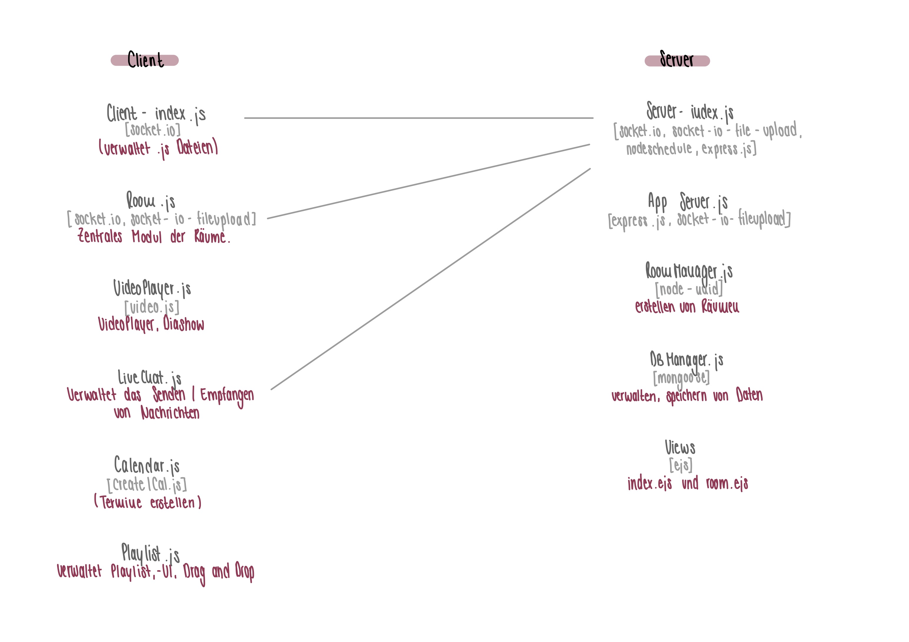

# Software Desing für WatchMates

## Client
**index.js:** [Socket.io]

Zentrale Kommunikationsschnittstelle mit dem Server. Leitet die Eingabe der Clients zum Server weiter und verwaltet die Antworten des selbigen:
Zu erstelltem Raum weiterleiten, auf bereits existierenden Raum weiterleiten, Erstellten Raum über das Termin-Interface anzeigen

**room.js:** [Socket.io, socket-io-fileupload]

User Interface für Room,
Beim Betreten eines Raums erscheint ein Inputfeld, welches einen Nickname fordert.
User-Interface welches mit dem Server-Status regelmäßig abgeglichen wird. Zentrales Modul für die Räume.
Anzeigen des Kinomodus; Falls ein Raum an einem bestimmten Datum erstellt wurde, wird ein Countdown angezeigt, dieser kann auch vorzeitig beendet werden. Lädt die Multimediadatei vom Server in den VideoPlayer/Diashow bei allen Clients des gleichen Raums. Laden der Datei vom Server abhängig von Playlistreihenfolge.

**VideoPlayer.js** [video.js]

Abspielen der Videos/Audios, Abfangen von Interaktion mit der Datei und Senden an den Server. Vor dem Start wird ein 3-Sekündiger Countdown abgespielt. Abspielen der Diashow, Abfangen von Interaktion mit den Bildern und Senden an den Server.

**LiveChat.js** [Socket.io]

Anzeigen des LiveChats und Eingabe der Nachrichten ermöglichen.

**Playlist.js**

Verwaltet die Wiedergabe der Player (Reihenfolge, aktuelle Datei).

**Calendar.js** [createICal.js]

Ermöglicht das Erstellen von Terminen und erstellt ICS-Datei.

**constants.js**

Speicherung aller Konstanten der Anwendung in einer Datei. 

## Server

**index.js** [Socket.io, socket-io-fileupload, nodeschedule, express.js]

Zentrale Kommunikationsschnittstelle mit den Clients. Verwaltet alle anderen Server Module.

**AppServer.js** [express.js, socket-io-fileupload]

Managen des Express-servers.

**DBManager.js** [mongoose]

Verwaltet die Datenbank und die Speicherung verschiedener Dateien

**RoomManager.js** [node-uuid]

Erstellen eines neuen Raumes mit einer unqiue ID. 

**Views** [ejs]

index.ejs und room.ejs werden als Templates für die Html-Dateien verwendet.

